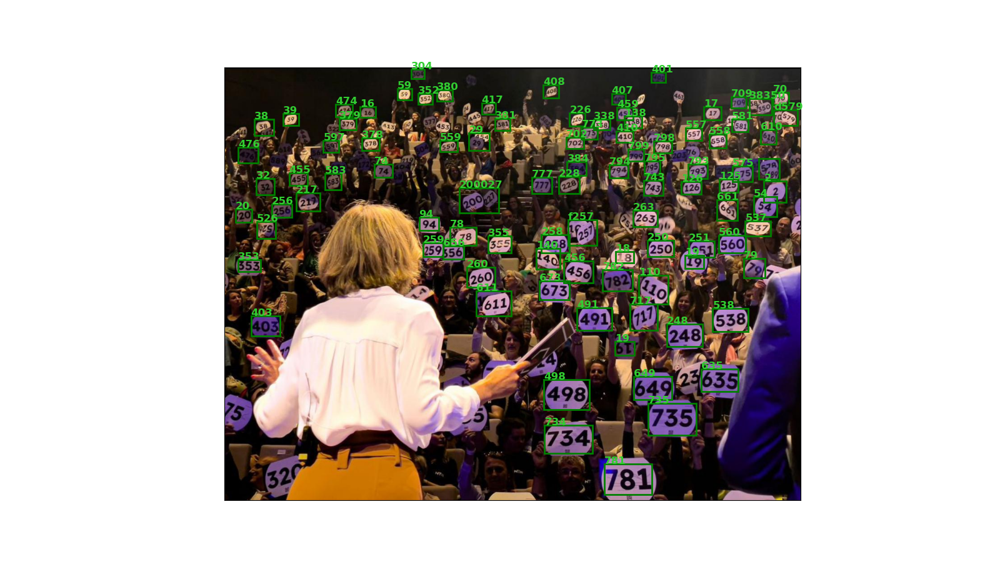

# Panel detection for "La Nuit du Bien Commun"


This project aims to recognize the signboard numbers from the video stream of the "La Nuit du Bien Commun".




In this repository, you will find code, utilities and documentation for the following operations:

- Extraction of images from video sequences
- Annotation of the panels in images
- Training a Faster R-CNN model to detect the panels
- Applying a pre-trained OCR engine to recognize the numbers in the detected panels

## Installation

You should first clone this project

```
git clone https://github.com/guillaume-heusch/nuitbiencommun.git
cd nuitbiencommun
```

### Create a conda environment
I use `conda`, but you if you prefer, you should normally be able to use `pip`.

```
conda env create -f environment.yml
conda activate nbc
```

### Build the documentation
Documentation can be built using `sphinx`:

```
sphinx-build doc sphinx
```

Now open the `sphinx/index.html` file in your favorite browser and follow along !
